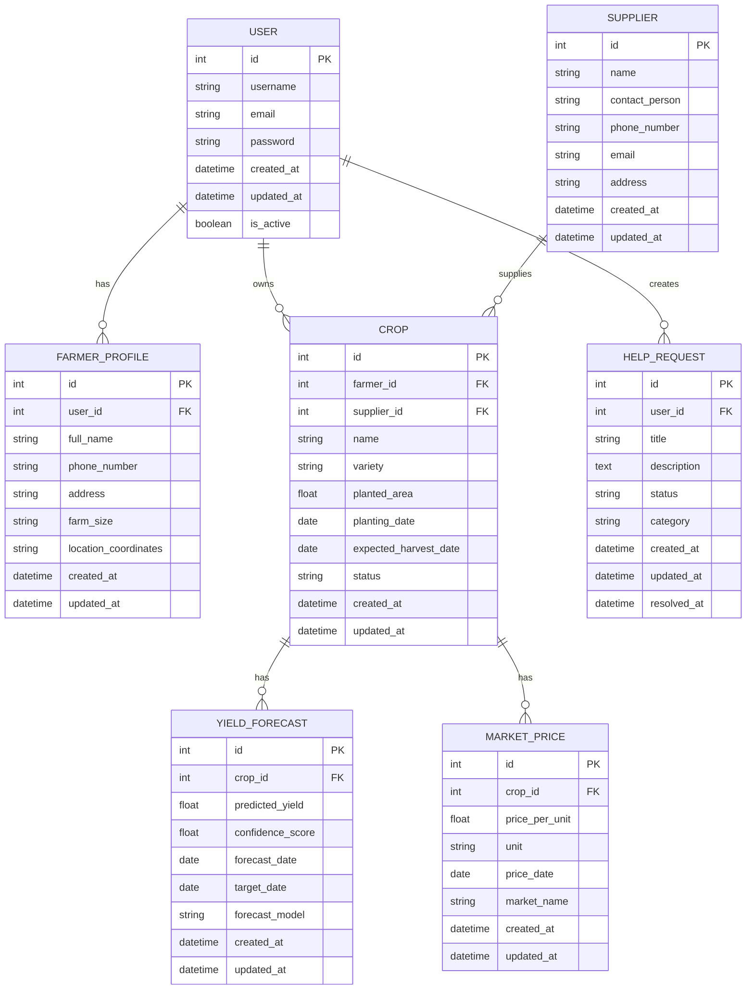

# SmartFarm ERD (Entity Relationship Diagram)

## Relationships

1. **User to FarmerProfile (1:1)**: Each user has exactly one farmer profile.
2. **User to Crop (1:many)**: A user (farmer) can own multiple crops.
3. **User to HelpRequest (1:many)**: A user can create multiple help requests.
4. **Crop to YieldForecast (1:many)**: Each crop can have multiple yield forecasts over time.
5. **Crop to MarketPrice (1:many)**: Each crop can have multiple price records over time.
6. **Supplier to Crop (1:many)**: A supplier can provide multiple crops.

## Notes

- All tables include `created_at` and `updated_at` timestamps for auditing.
- Foreign keys are denoted with `FK`.
- Primary keys are denoted with `PK`.
- String lengths and other constraints would be defined in the model definitions.
